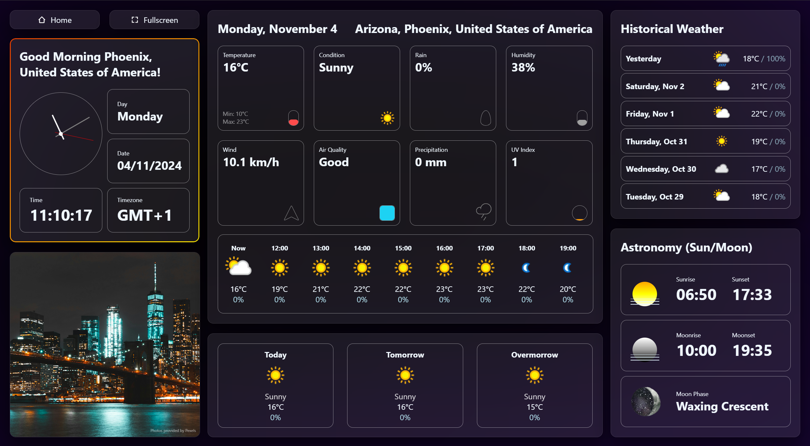

# Weather Web Application

A simple and visually stunning web application that provides current weather information for any location.  
[Link to website](https://l145.be/weatherweb.html)

## Features

- **Flexible Search Options**: Get weather details by entering city, country, coordinates, or IP address, or by letting us auto-detect your location!
  - **City**: e.g., Antwerp
  - **Country**: e.g., Belgium
  - **Longitude/Latitude**: e.g., 51.219448, 4.402464
  - **IP Address**: e.g., 44.222.239.211

- **Comprehensive Weather Data**:
  - **Current Weather**: Displays temperature, humidity, wind speed, air quality, UV index, and weather conditions.
  - **Forecast**: See hourly and daily forecasts for up to 3 days.
  - **Historical Weather**: Access weather data from previous days for comparison.
  - **Astronomy Info**: Shows sunrise, sunset, moonrise, moonset, and current moon phase.

- **Responsive and User-Friendly Design**:
  - **Desktop-Optimized**: Clean, structured layout for large screens.
  - **Fullscreen Mode**: Dive into the app without distractions.
  
- **Enhanced User Experience**:
  - **Interactive Dashboard**: Dynamic widgets and icons make data easy to understand.
  - **Real-Time Clock and Date**: Local time, day, and timezone are displayed.
  - **Location-Based Images**: Beautiful images that match the location.

- **Performance Optimizations**:
  - **Efficient Data Loading**: Optimized for fast data retrieval.
  - **Error Handling**: User-friendly error messages for invalid inputs or location detection issues.

- **Easy Setup**:
  - **Simple Configuration**: No configuration, just visit our [website](https://l145.be/weatherweb.html)!

## Technologies Used

- HTML
- CSS
- JavaScript
- Python (Flask)
- WeatherAPI
- Pexels API

## Installation

1. No installation needed! 
2. here's the website: [WeatherWeb](https://l145.be/weatherweb.html)

## Support

Struggling with something, or is something wrong with the website? 
Contact us!

- E-mail: support@l145.be

## Connect with us!

- Front-end: Aryan Shah
    - [GitHub](https://github.com/legelff)
    - [LinkedIn](https://www.linkedin.com/in/aryan-shah-752364295)
    - [Instagram](https://www.instagram.com/l.egelf)
- Back-end: Karolis Kalinauskas
    - [GitHub](https://github.com/KarolisKalinauskas1)
    - [LinkedIn](https://www.linkedin.com/in/karolis-kalinauskas-8735ab253/)
